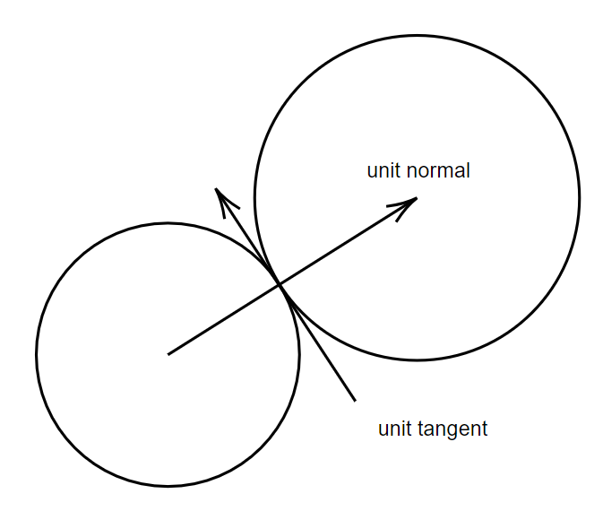
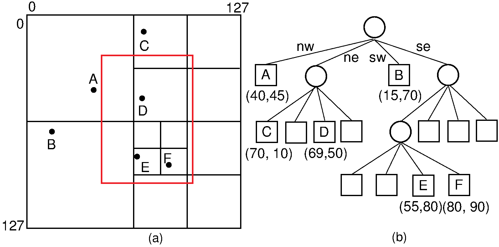

# Demo

https://githubcom/TrisTaam/QuadTree-Algorithm/assets/91814360/6a935fba-aa48-425e-b949-08b2b3332c8f

# Implementation

## Elastic Collision

### In physics (One-dimensional):

The momentum of an object: $$p = mv$$

The kinetic energy of an object: $$KE = \frac{mv^2}{2}$$

Considering the 2-object system as a closed system:

- Conservation of momentum: $$m_1v_1 + m_2v_2 = m_1v_1' + m_2v_2'$$

- Conservation of kinetic energy: $$\frac{m_1v_1^2}{2} + \frac{m_2v_2^2}{2} = \frac{m_1v_1'^2}{2} +
  \frac{m_2v_2'^2}{2}$$

Combining these two equations gives the velocities after collisions of object 1 and 2:

$$v_1' = \frac{v_1(m_1 - m_2) + 2m_2v_2}{m1+m2}$$

$$v_2' = \frac{v_2(m_2 - m_1) + 2m_1v_1}{m1+m2}$$

### In two-dimensional

Let $x_1$, $y_1$, $x_2$, $y_2$ be the $x$ and $y$ coordinates of the centers of the circle.

Spliting the velocity vectors of the two objects into the vectors which are normal and tangent to the surface of the
collision:

Normal vector: $\vec{n} = (x_2 - x_1, y_2 - y_1)$

The unit normal vector: $\vec{un} = \frac{\vec{n}}{|\vec{n}|} = \frac{\vec{n}}{\sqrt{n_x^2 + n_y^2}}$

The unit tangent vector: $\vec{ut} = (-un_y, un_x)$

The $x$ and $y$ components of the velocities put into vectors:

$$\vec{v_1} = (v_{1x}, v_{1y})$$

$$\vec{v_2} = (v_{2x}, v_{2y})$$

After the collision, the tangential component of the velocities is unchanged because there is no force along the line
tangent to the collision surface and the normal component of the velocities can be found using the one-dimensional
collision formulas presented above.

The unit normal vector is multiplied by the scalar (plain number) normal velocity after the collision to get a vector
which has a direction normal to the collision surface and a magnitude which is the normal component of the velocity
after the collision.

Let $v_{1n}, v_{2n}$ be the scalar velocity of two objects in the normal direction.

Let $v_{1t}, v_{2t}$ be the scalar velocity of two objects in the tangent direction.

$$v_{1n} = \vec{un}.\vec{v_1}$$

$$v_{1t} = \vec{ut}.\vec{v_1}$$

$$v_{2n} = \vec{un}.\vec{v_2}$$

$$v_{2t} = \vec{ut}.\vec{v_2}$$

The tangential components of the velocity do not change after the collision because there is no force between the
circles in the tangential direction during the collision:

$$v_{1t}' = v_{1t}$$

$$v_{2t}' = v_{2t}$$

The normal component of the velocities can be found using the one-dimensional collision formulas presented above:

$$v_{1n}' = \frac{v_{1n}(m_1 - m_2) + 2m_2v_{2n}}{m1+m2}$$

$$v_{2n}' = \frac{v_{2n}(m_2 - m_1) + 2m_1v_{1n}}{m1+m2}$$

Multiplying the unit normal vector by the scalar normal velocity to you get a vector which has a direction that is
normal to the surfaces at the point of collision and a magnitude equal to the normal component of the velocity. It is
similar for the tangential component:

$$\vec{v_{1n}' = v_{1n}'.\vec{un}}$$

$$\vec{v_{1t}' = v_{1t}'.\vec{ut}}$$

$$\vec{v_{2n}' = v_{2n}'.\vec{un}}$$

$$\vec{v_{2t}' = v_{2t}'.\vec{ut}}$$

The final velocity vectors by adding the normal and tangential components for each object:

$$\vec{v_1'} = \vec{v_{1n}'} + \vec{v_{1t}'}$$

$$\vec{v_2'} = \vec{v_{2n}'} + \vec{v_{2t}'}$$

## QuadTree

A quadtree is a tree data structure in each node represents a rectangular region of space, which is recursively
subdivided into four smaller regions: NW, NE, SW, SE. This process continues until each region contains a manageable
number of objects.

In collision detection, a quadtree helps efficiently manage and query spatial data. When checking for collisions,
objects are inserted into the quadtree based on their spatial location. Each object's bounding box determines its
placement within the appropriate quadrant.

When querying for potential collisions, the quadtree is traversed starting from the root. Only the nodes (quadrants)
that intersect with the object's bounding box are examined. This selective examination helps in quickly identifying and
processing only those objects that are near each other, thereby optimizing collision detection and improving performance
in large-scale simulations.

The complexity of processing collision detection using query quadtree: $O(nlogn)$
